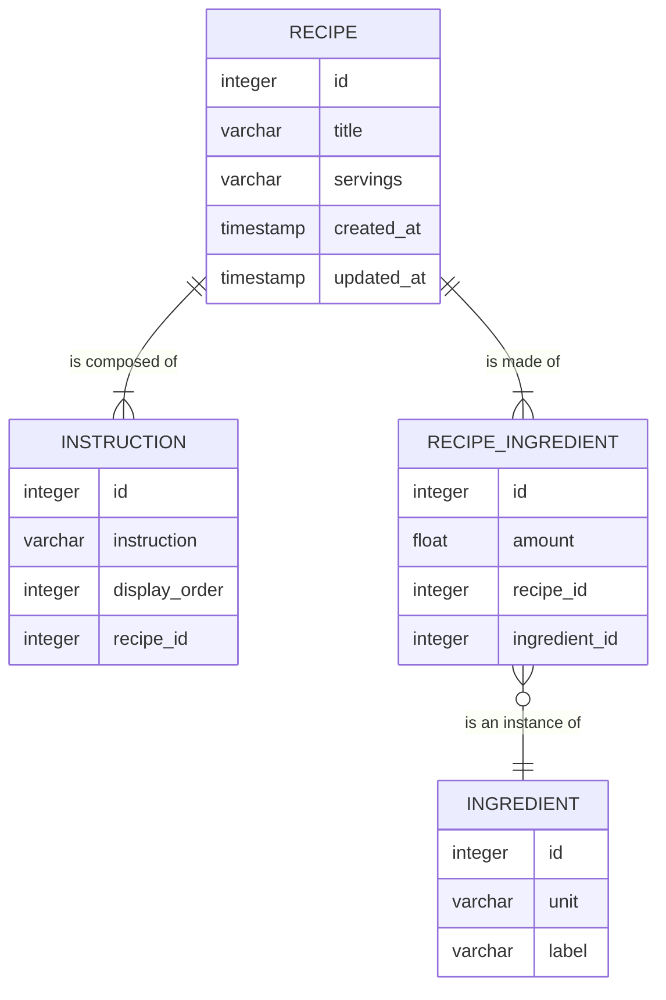

Entity Relationship diagram of the data

```mermaid
erDiagram

  RECIPE
  INSTRUCTION
  RECIPE_INGREDIENT
  INGREDIENT

  RECIPE ||--|{ INSTRUCTION : "is composed of"
  RECIPE ||--|{ RECIPE_INGREDIENT : "is made of"
  RECIPE_INGREDIENT }o--|| INGREDIENT : "is an instance of"

  RECIPE {
    integer id
    varchar title
    varchar servings
    timestamp created_at
    timestamp updated_at
  }

  INSTRUCTION {
    integer id
    varchar instruction
    integer display_order
    integer recipe_id
  }

  RECIPE_INGREDIENT {
    integer id
    float amount
    integer recipe_id
    integer ingredient_id
  }

  INGREDIENT {
    integer id
    varchar unit
    varchar label
  }
```
